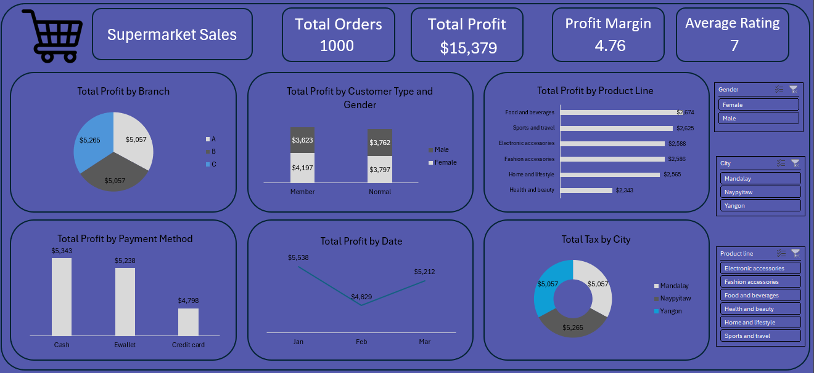

# Supermarket-Sales-Analysis-Excel
Dashboard project for supermarket sales analysis using Excel

📊 Supermarket Sales Dashboard – Descriptive Data Analysis Project
This project presents a professional sales dashboard built using Microsoft Excel and Power Query. 
The dashboard is based on supermarket sales data and provides a descriptive analysis of profits across different categories and time periods.

📁 Dataset
- Source: supermarket_sales.csv
- Contains 1,000 transactions with fields including:
  - Branch, City, Product Line
  - Customer Type, Gender
  - Payment Method, Total, Tax, Rating
  - Date, Time

🎯 Project Goals
- Clean and prepare the dataset using Power Query.
- Perform descriptive statistics using Excel functions and PivotTables.
- Design a dashboard for visual exploration of total profits and related KPIs.

📌 Visuals Included
- Total Profit by Branch (Pie Chart)
- Total Profit by Product Line (Bar Chart)
- Total Profit by Date (Line Chart)
- Total Profit by Payment Method (Column Chart)
- Total Profit by Customer Type and Gender (Clustered Column Chart)
- Total Tax by City (Pie Chart)
- KPI Cards: Total Orders, Total Profit, Profit Margin, Average Rating
- Slicers for Gender, City, Product Line

🛠️ Tools Used
- Microsoft Excel (PivotTables, Charts, Dashboard Layout)
- Power Query (Data Cleaning and Transformation)

📚 Key Learnings
- How to extract actionable insights using descriptive analysis.
- Importance of customer segmentation and category performance tracking.
- Building interactive Excel dashboards for business decision support.

## 👤 Author
Mohammad Anwar Ahmed – Data Analyst 

